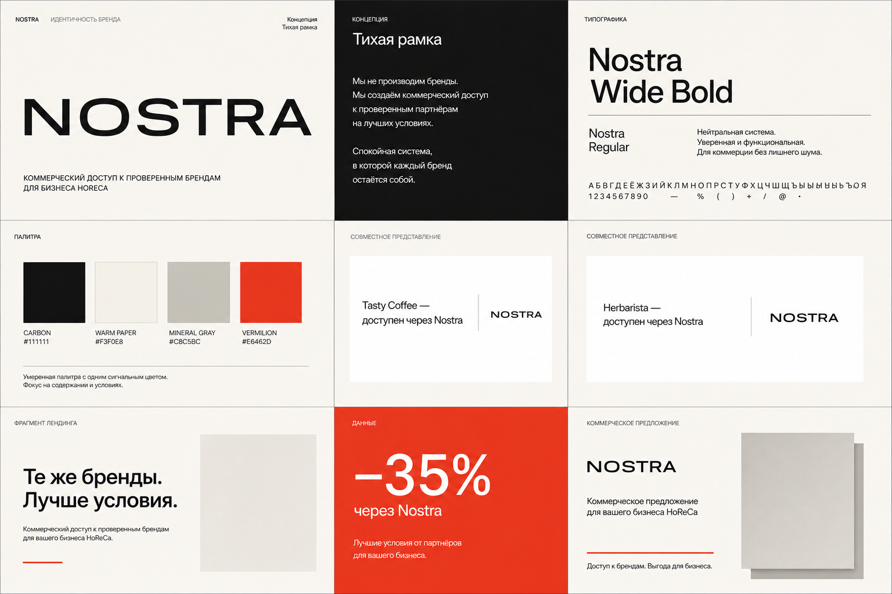
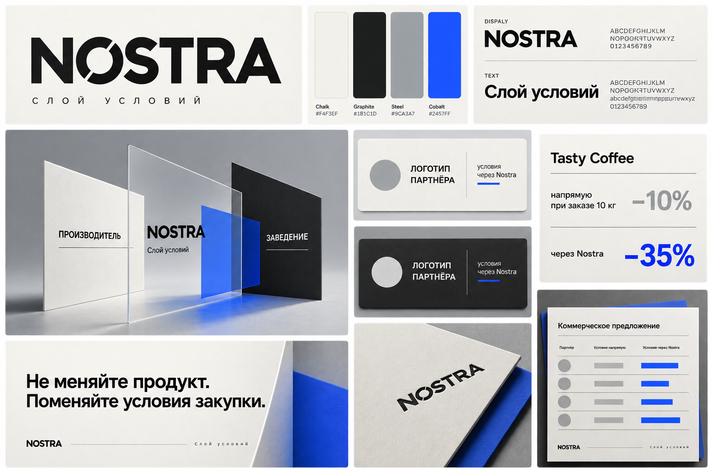
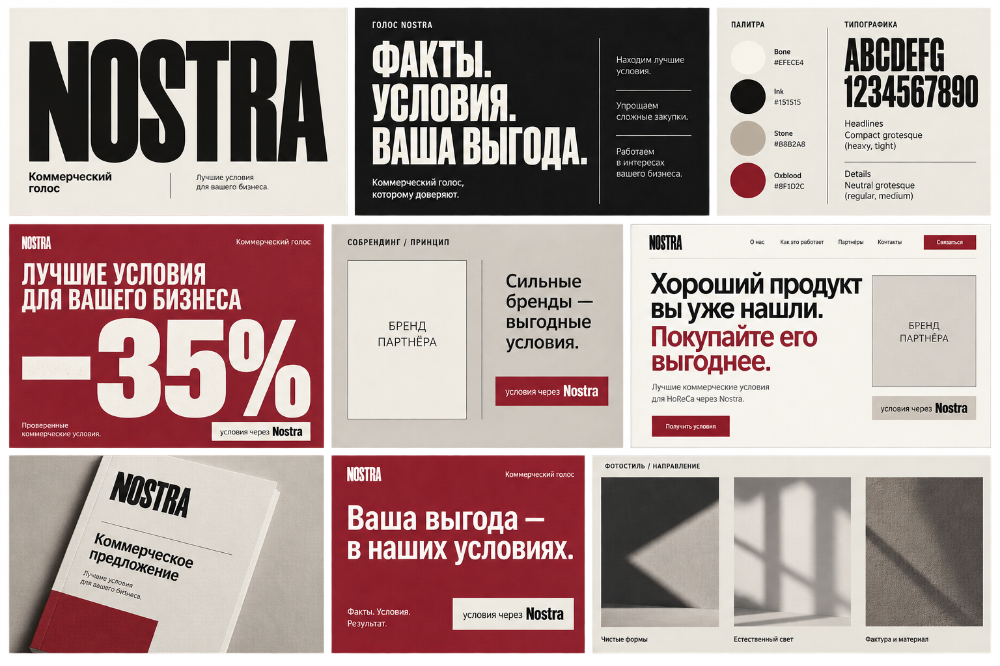

# Nostra — три направления визуальной идентичности

Brand-board’ы — визуальные концепты, а не готовые логотип-файлы. Пользователем выбрано направление **C — «Коммерческий голос»**. Его production-система зафиксирована в [`../BRAND_GUIDE.md`](../BRAND_GUIDE.md).

## A — «Тихая рамка»

### Стратегическая идея

Nostra уверенно остаётся на втором плане продукта, но делает всю коммерческую коммуникацию собранной и узнаваемой. Сила — в спокойствии и точности.

### Визуальный характер

Редакционный, светлый, зрелый, открытый. Большие поля, низкая визуальная температура, одна чёткая красная метка для выгоды и действия.

### Логотип

Широкий типографический wordmark `NOSTRA` без отдельной эмблемы. Узнаваемость строится на пропорциях букв, плотности и необычно спокойном ритме, а не на символе категории.

### Типографика

- Display: широкий neo-grotesque, ориентир — Suisse Int’l / Neue Montreal / ABC Diatype Wide.
- Text: нейтральный grotesque с хорошей кириллицей, ориентир — Geist или Suisse Int’l.
- Данные: табулярные цифры, крупный кегль, минимум декоративных подписей.

### Композиция

Модульная редакционная сетка, крупные белые поля, карточки без теней. Партнёрские блоки располагаются внутри стабильных нейтральных полей, но не унифицируются по цвету.

### Палитра

- Warm Paper `#F3F0E8`
- Carbon `#111111`
- Mineral `#C8C5BC`
- Nostra Vermilion `#E6462D`

### Фотография

Только реальные продукты и рабочие сцены. Единый арт-дирекшн достигается кремовой или серой поверхностью, естественным боковым светом, стабильным углом и большим свободным полем. Цвет упаковки сохраняется.

### Co-branding

```text
Tasty Coffee
доступен через Nostra
```

```text
Herbarista
доступен через Nostra
```

Сервисная подпись всегда меньше логотипа партнёра; красный Nostra используется в условии или CTA, но не перекрашивает партнёра.

### Лендинг

Hero строится вокруг фразы «Те же бренды. Лучше условия.». Далее — крупный подтверждённый факт `−35% через Nostra`, реальные карточки партнёров и прозрачная механика начала работы.

### КП

Светлая обложка, широкий wordmark, одна тонкая красная линия, крупное имя клиента. Таблицы спокойные, скидка и итог выделяются vermilion без цветового шума.

### Сильные стороны

- лучше всего сосуществует с разными упаковками;
- выглядит уверенно и не переигрывает масштаб бизнеса;
- легко переносится в сайт, прайс и PDF;
- минимальный риск превратиться в coffee-brand или SaaS.

### Риски

- без дисциплины в фотографии может стать слишком нейтральным;
- требует качественной типографики и точного wordmark, иначе потеряет характер.



## B — «Слой условий»

### Стратегическая идея

Nostra — видимый, но прозрачный слой между производителем и заведением. Она не меняет продукт; она меняет доступ, цену, логистику и правила закупки.

### Визуальный характер

Структурный, точный, более технологичный и динамичный. Главная метафора — независимые плоскости и прослойка условия, без стрелок, цепей и рукопожатий.

### Логотип

Компактный wordmark с одним осмысленным «открытым соединением» внутри буквы. Отдельный знак допускается только как производная этой буквенной конструкции.

### Типографика

- Display: компактный grotesque, ориентир — Druk Condensed / Archivo Narrow как направление, не финальный выбор.
- Text: строгий нейтральный grotesque с широкой языковой поддержкой.
- Данные: контраст размеров и горизонтальные сравнительные поля.

### Композиция

Асимметричная сетка; наложение прозрачной и непрозрачной плоскостей; смысловая схема `производитель / Nostra / заведение`. Слои всегда несут реальную роль, а не служат украшением.

### Палитра

- Chalk `#F4F3EF`
- Graphite `#1B1C1D`
- Steel `#9CA3A7`
- Nostra Cobalt `#2457FF`

### Фотография

Документальные фрагменты рабочего пространства и реальные продукты, снятые через прозрачную или отражающую плоскость. Эффект применяется умеренно и никогда не закрывает логотип производителя.

### Co-branding

Логотип партнёра находится в собственной зоне. Рядом, через тонкую вертикальную границу:

```text
условия
через Nostra
```

Для Tasty допустим отдельный проверенный модуль: `напрямую при 10 кг — скидка 10% / через Nostra — скидка 35%`. Эти значения не переносятся на Herbarista или других партнёров.

### Лендинг

Hero: «Не меняйте продукт. Поменяйте условия закупки». Далее — схема ролей, сравнение условий и блоки партнёров.

### КП

Документ воспринимается как ясная система сравнения: условия напрямую и через Nostra располагаются на разных плоскостях/колонках. Синий всегда означает слой Nostra, а не «лучшую характеристику продукта».

### Сильные стороны

- наиболее точно объясняет посредническую роль;
- создаёт узнаваемый конструктивный приём;
- особенно силён в сравнительных таблицах и презентациях.

### Риски

- при избытке плоскостей может приблизиться к SaaS/fintech;
- требует строгого лимита эффектов и очень ясных текстов.



## C — «Коммерческий голос»

### Стратегическая идея

Nostra узнаваема по тому, как говорит о сделке: коротко, прямо и доказательно. Факты, условия и выгода становятся главным графическим материалом.

### Визуальный характер

Смелый, печатный, плотный, немного дерзкий. Это не скидочная реклама, а уверенный язык современного коммерческого партнёра.

### Логотип

Высокий компактный wordmark `NOSTRA` с тщательно настроенной шириной букв. Он работает как подпись и как крупный заголовочный блок.

### Типографика

- Display: выразительный узкий grotesque, ориентир — Druk / PP Formula Condensed.
- Text: спокойный neutral grotesque.
- Цифры: очень крупные; на одном экране — один главный факт.

### Композиция

Резкие изменения масштаба, широкие поля, крупные фразы, жёсткие прямоугольные заливки. Никаких декоративных кодов и нумерации — только реальные слова и цифры.

### Палитра

- Bone `#EFECE4`
- Ink `#151515`
- Stone `#B8B2A8`
- Nostra Oxblood `#8F1D2C`

### Фотография

Реальные продукты и люди в документальной манере. Кадрирование смелее, чем в направлении A; фон и свет остаются естественными. Цвет партнёра не подавляется монохромным фильтром.

### Co-branding

Логотип производителя занимает самостоятельный белый/светлый блок. Под ним — небольшая фирменная плашка Nostra:

```text
условия через Nostra
```

Коммерческий факт может быть значительно крупнее обеих марок, если он подтверждён и ясно подписан.

### Лендинг

Hero: «Хороший продукт вы уже нашли. Покупайте его выгоднее». Следующий экран — `Tasty Coffee / −35% через Nostra`. Остальная информация собирается в короткие доказательные блоки.

### КП

Самое выразительное направление для обложек, офферных разворотов и коротких sales-материалов. Внутренние таблицы становятся спокойнее и используют ту же типографическую иерархию.

### Сильные стороны

- самая сильная узнаваемость в рекламе и соцсетях;
- выгода считывается мгновенно;
- формирует самостоятельный характер без продуктовой метафоры.

### Риски

- легко скатиться в визуальный язык распродажи;
- плотная типографика требует особенно тщательной адаптации на мобильном;
- может быть громче партнёрского бренда, если не соблюдать иерархию.



## Сравнение

| Критерий | Тихая рамка | Слой условий | Коммерческий голос |
|---|---|---|---|
| Нейтральность рядом с партнёрами | Максимальная | Высокая | Средняя |
| Ясность роли посредника | Высокая | Максимальная | Высокая |
| Выразительность рекламы | Средняя | Высокая | Максимальная |
| Риск выглядеть как SaaS | Минимальный | Средний | Минимальный |
| Риск затмить партнёра | Минимальный | Низкий | Средний |
| Сила для КП и прайса | Высокая | Максимальная | Высокая |
| Масштабирование на новых партнёров | Максимальное | Высокое | Высокое |

## Результат выбора

Выбрано направление **«Коммерческий голос»**. В production-версии бордовый затемнён, wordmark построен как самостоятельная векторная геометрия, а узкая плакатная типографика ограничена короткими коммерческими фактами. Иерархия партнёров и правила против визуального присвоения продукта закреплены в финальном гайде.
